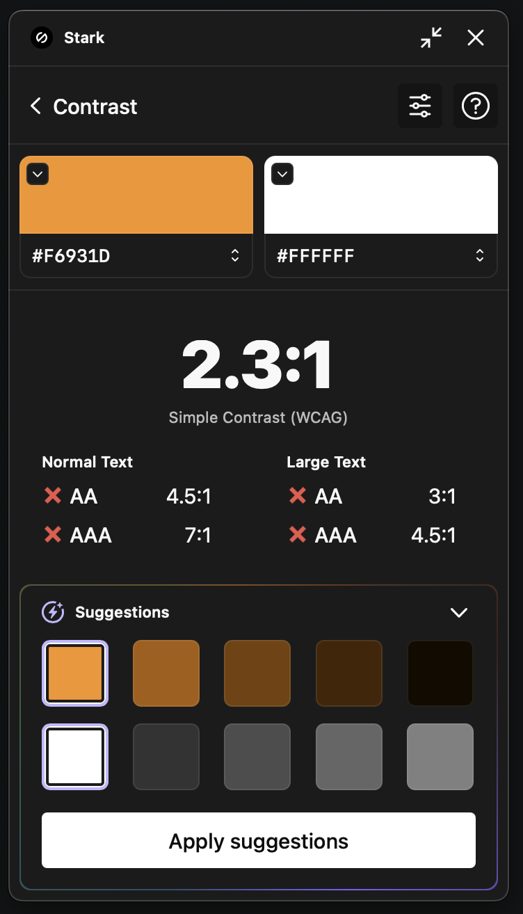
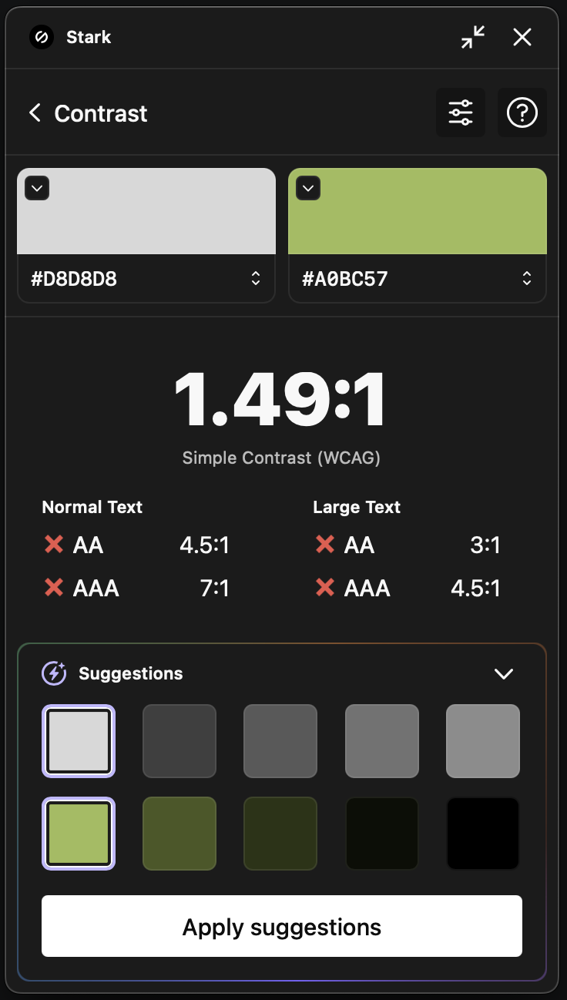
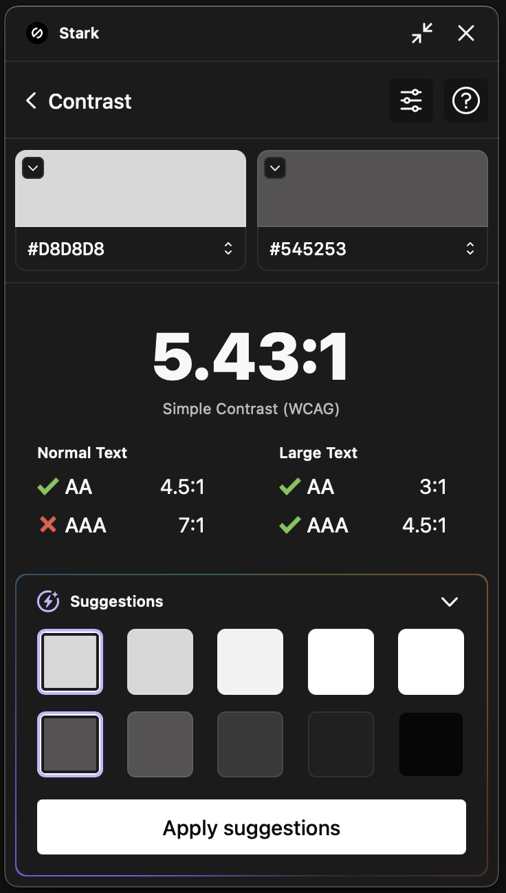
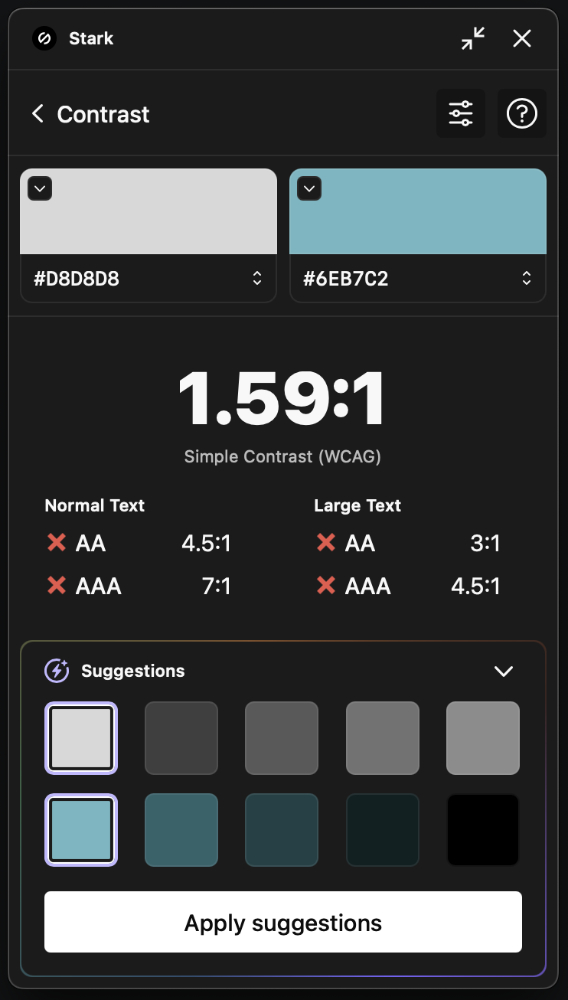

# QuinStreet Lead Generation Landing Page

## Overview

This project is a responsive and accessible lead generation landing page. It features real-time form validation, phone number masking, AJAX form submission, and a background color transition animation. This page has been specifically optimized for performance and accessibility.

---

## Features and Implementation Details

### General Features

- **Pixel-Perfect Design:** Developed to match provided mockups exactly, ensuring visual fidelity.
- **Responsive Design:** Adapts to both mobile and desktop views, with 767px defined as the mobile breakpoint.
- **Background Color Transition:**
  - Utilizes a clever technique involving opacity transitions of pseudo-elements. This achieves the visual effect of transitioning background colors from `#ECF8FB` to `#EFEFEF` over 5 seconds, and vice versa, in a loop.
  - This method leverages a more efficient use of resources compared to direct color transitions, as modifying opacity is less CPU-intensive than changing background color properties.
- **WCAG Compliance:** Focus on accessibility for all users.
- **Text and Layout Flexibility:** The structure is resilient to content changes within the source, maintaining layout integrity and ensuring all content is accessible without breaking the design.

### Cross-Browser Compatibility

Ensuring cross-browser support was a key consideration for this project. The application has been tested thoroughly across a range of modern browsers to provide a consistent user experience. Here are the specifics:

#### Browsers Tested

- Desktop Browsers:
  - Chrome version 130 and 131
  - Mozilla Firefox version 132 and 133
  - Safari version 17 and 18
  - Microsoft Edge version 131
- Mobile Browsers:
  - Chrome mobile 131
  - Mozilla Firefox mobile 133
  - Safari mobile 18

#### Testing Tools and Approach

- **Device Testing:** The latest versions were tested using personal devices to ensure optimal user experience.
- **[BrowserStack](https://www.browserstack.com/) Utilization:** Used BrowserStack to test across a variety of older browser versions and devices, ensuring comprehensive compatibility.

#### Compatibility Features

- **Modern Browser Focus:** While primarily targeted at modern browsers, specific efforts have been made to maintain usability in older environments, aligning with insights from requirement discussions.
- **Use of Progressive Enhancement:** Leveraged progressive enhancement techniques, such as the `@supports` rule, to ensure that newer CSS properties like inset provide benefits without compromising older browser functionality.

These considerations assures that the application adheres to cross-browser standards, achieving functionality and design integrity across diverse platforms.

### Form Functionality

- **Input Validation:**
  - Implemented both via HTML constraints and Javascript, ensuring redundancy in client-side validation.
  - Validation feedback is visualized by highlighting erroneous fields with a border in `#D50303`, offering immediate user feedback.
  - **Name:** Requires at least 2 characters.
  - **Phone Number:** Must be in the format `(XXX) XXX-XXXX` and validated both on blur and during form submission.
  - **Email:** Must adhere to valid email format standards.
  - **City/State:** Optional fields.
  - Displays red border for invalid inputs.
- **Phone Number Masking:** Applied during the `blur` event to prevent user experience pitfalls associated with formatting during `input` events (i.e., preventing awkward cursor positioning and motion).
- **Data Submission:**
  - Data is posted asynchronously to the provided endpoint `https://formsws-hilstaging-com-0adj9wt8gzyq.runscope.net/solar`, ensuring a fluid form submission without page reload.
  - Post-submission, inputs are disabled along with the submit button to ensure data integrity and align with the form’s completed state, even though the latter wasn't an explicit requirement.

### Accessibility

- **Screen Reader Optimization:**
  - Integrated `sr-only` class for hidden yet accessible labels, ensuring that visual elements maintain information hierarchy and semantic meaning for users using assistive technologies.
- **Keyboard Navigation:**
  - The page has been structured to maintain intuitive tabbing order, allowing seamless keyboard navigation across all interactive elements.

#### Accessibility and Contrast Considerations

There are aspects regarding accessibility and contrast that deserve consideration for future enhancements:

- **Contrast Ratio Observations:**
  - The submit button currently has a contrast ratio of `2.3`, which does not meet WCAG guidelines. Adjusting the color to achieve compliance is a potential improvement.
  - The "advertorial" tag has a contrast ration of `1.49`, which aldo does not meet WCAG standards. Enhancing the contrast by adjusting the text color or background is recommended.
  - The article text achieves AA compliance with a contrast ratio of `5.43`. For optimal accessibility, consideration could be given to reaching AAA standards for better legibility.
  - The "Read more" link within the article section faces contrast challenges with an approximate ratio of `1.59`, due to the patterned background. A review of color or placement might be necessary to enhance accessibility.









- **Color Usage for Errors:**
  - Red outlines are used to mark errors in form fields. While effective, users who have difficulty distinguishing colors might benefit from supplementary indicators such as warning icons or text descriptions, enhancing overall user guidance.

While adhering strictly to the prototype, these observations aim to inform and guide future development, ensuring that the project achieves comprehensive accessibility goals and aligns with WCAG standards.

### Custom CSS Properties

In this project, custom CSS properties are used to manage various styles. To provide flexibility while maintaining fallback values, pseudo-private custom properties have been implemented, identified by a leading underscore (e.g., `--_button-background`).

**Rationale:**

1. **Separation of Concerns:** Pseudo-private properties allow the internal component logic to be distinguished from customizable API-like properties that developers can set.
2. **Defaults Management:** Utilizing a fallback mechanism ensures default styling is always applied even if external variables are not set, preventing unstyled components.
3. **Reduced Specificity Issues:** Using internal properties avoids forcing developers to override existing rules with higher specificity, thereby promoting ease of style adjustments.
4. **Component Isolation:** This approach minimizes the chances of external styles inadvertently affecting component-specific styles, aligning with the modular and encapsulated design principle.

### Font Hosting and Formats

Due to the GDPR regulations in Europe, the fonts used are self-hosted. This setup avoids external requests to Google Fonts, which helps in protecting user privacy by not sharing data without user consent.

- Both `.woff` and `.woff2` formats are utilized:
  - **WOFF2** is the modern standard, offering better compression and performance.
  - **WOFF** provides fallback support for browsers lacking WOFF2 compatibility.
  - The `local()` function is used to reference fonts locally, enhancing performance by reducing the need for additional HTTP requests.

### Optimized Image Handling

In line with the project's requirement for retina support, careful consideration was given to the selection and optimization of images, balancing quality and performance:

- **Company Logo:**
  - The logo has been exported as a SVG file instead of a PNG. By choosing SVG, the logo maintains its sharpness at any display size, fulfilling the retina support requirement without increasing file size.
  - The SVG is minified, reducing its size to 5KB. This is significantly smaller than a 2x PNG export, which would be about 20KB, thereby enhancing loading speed and reducing bandwidth use.
  - Given the low likelihood of style changes directly within the SVG file, minification was a suitable optimization step.
- **Background Pattern:**
  - The background pattern spans a large portion of the page and similarly benefits from the vector scalability of SVG.
  - By using an SVG file, the potential file size is reduced from an estimated 7785KB (2x PNG) to 526KB.
  - The SVG is deliberately unminified to allow for potential future adjustments, such as color changes, without introducing additional complexities.

This approach not only addresses the retina display requirement by utilizing scalable vector graphics but also ensures the project's assets are lean and performant, thereby supporting faster page loads and a more responsive user experience.

---

## Setup Instructions

1. Clone the repository:

```bash
  git clone <repository-url>
```

2. Navigate to Project Directory:

```bash
  cd lead-gen-landing-page
```

3. Open `index.html` in your browser to view the landing page.

---

## File Structure

``` bash
project
│   index.html
│   README.md
│
└─── css
│    │   root.css
│    │   styles.css
│   
└─── js
│    │   index.js
│   
└─── assets
│    │
│    └─── fonts
│    │    │   
│    │    └─── Montserrat
│    │     
│    └─── images
│   
└─── docs

```

- `index.html`: Main HTML structure.
- `root.css`: Defines base styles and variables.
- `styles.css`: Styles for responsive layout, animations, and design.
- `index.js`: JavaScript logic for form handling, AJAX, and DOM interactions.
- `assets`: Contains fonts and image resources.

---

## Development Notes

- **Time Investment:** The completion of this project spanned approximately X hours. The styling and responsive adjustments, specifically tailoring pixel-perfect outcomes across devices and compliance with WCAG, were notably time-intensive.
- **Challenges:**
  - Developing the border for the article section by creatively employing background properties combined with linear gradients to produce a decorative border effect.
  - Creating a visually appealing yet resource-efficient background transition using pseudo-elements.

---

## User Experience Recommendations

- **Visible Labels for Inputs:** To enhance UX, visible input labels could be useful, as current reliance on placeholders may limit contextual guidance upon text input resulting in reduced clarity.
- **Labels for Screen Readers:** Acknowledging users with screen readers, context-providing labels were specifically integrated for intuitive navigation and usage.
- **Post-Submission State:** Post-successful submission, disabling form inputs alongside the button not only meets the requirements but mitigates potential user confusion—ensuring data integrity post-interaction.

---

## Live Site

Visit the hosted site to explore the functionalities and view the project in action: [Hosted Page URL](https://yaxchemanrique.github.io/quinstreet--landing-page/)

---

## Final Comments

This project underscores best practices in front-end development such as responsiveness, accessibility, and efficient coding practices. It offers a solid foundation for further scalability and enhancement to accommodate potential future requirements or features. Future endeavors could enhance error feedback mechanisms, integrating a more dynamic inline validation approach with descriptive error messaging.
